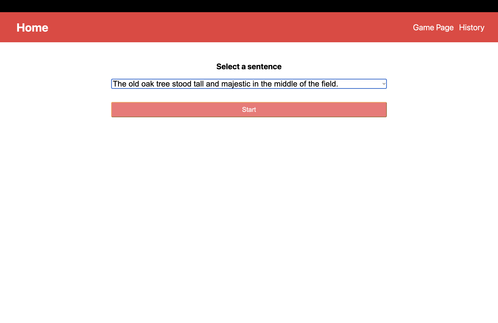
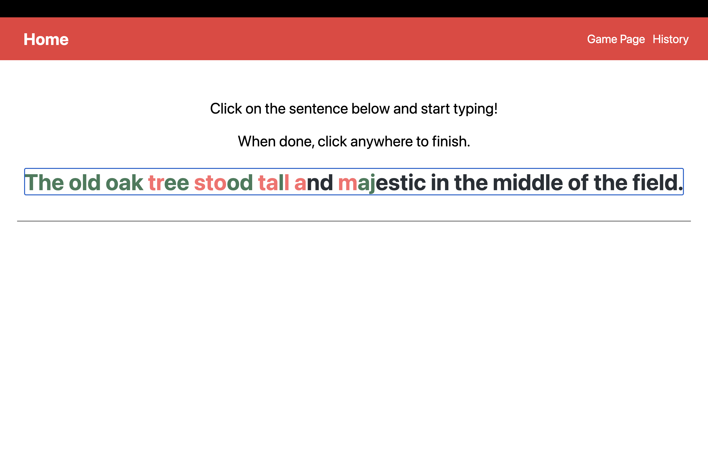
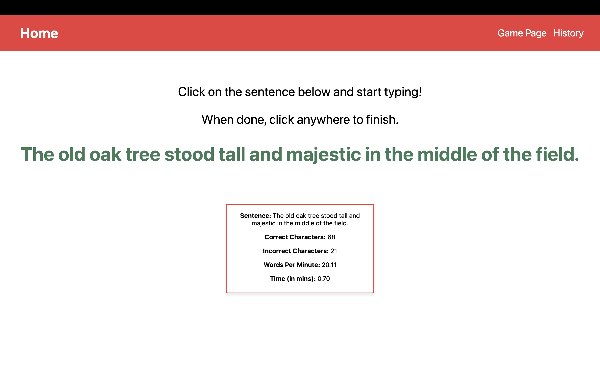
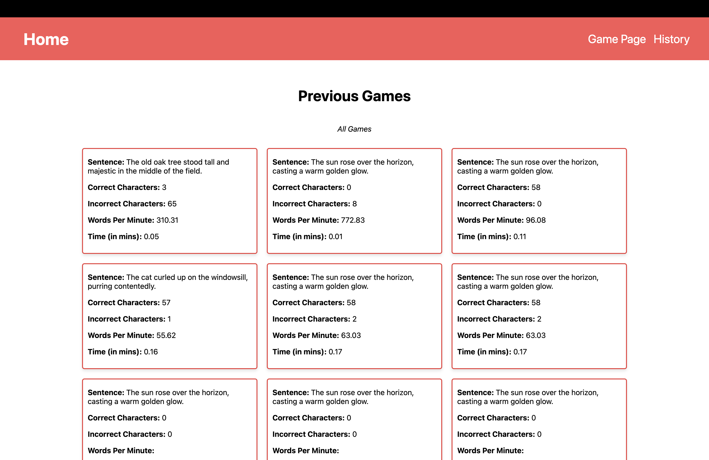

<!-- PROJECT LOGO -->
<br />
<div align="center">
  <a href="https://github.com/github_username/repo_name">
    
  </a>

<h3 align="center">Type Racer</h3>

  <p align="center">
    Typing skill assessment and tracked lifetime history of game statistics for users to refine typing proficiency and be able to have a comprehensive overview of their performance.
    <br />
    <a href="https://github.com/pakuang/TypeRacer"><strong>Explore the docs »</strong></a>
    <br />
    <br />
    <a href="https://github.com/pakuang/TypeRacer">View Demo</a>
    ·
    <a href="https://github.com/pakuang/TypeRacer/issues">Report Bug</a>
    ·
    <a href="https://github.com/pakuang/TypeRacer/issues">Request Feature</a>
  </p>
</div>


<!-- TABLE OF CONTENTS -->
<details>
  <summary>Table of Contents</summary>
  <ol>
    <li>
      <a href="#about-the-project">About The Project</a>
      <ul>
        <li><a href="#built-with">Built With</a></li>
      </ul>
    </li>
    <li><a href="#usage">Usage</a></li>
    <li>
      <a href="#getting-started">Getting Started</a>
      <ul>
        <li><a href="#installation">Installation</a></li>
      </ul>
    </li>
    <li><a href="#contact">Contact</a></li>
    <li><a href="#acknowledgments">Acknowledgments</a></li>
  </ol>
</details>


<!-- ABOUT THE PROJECT -->
## About The Project

A dynamic platform that allows assessment of user typing skills including typing speed (WPM) and incorrect character count. Sentences can be customized. The typing test history and statistics are updated and viewable in Game History to track typing progress!

<p align="right">(<a href="#readme-top">back to top</a>)</p>


### Built With

* [![Node][NodeJS]][Node-url]
* [![Next][Next.js]][Next-url]
* [![React][React.js]][React-url]
* [![Bootstrap][Bootstrap.com]][Bootstrap-url]
* [![MongoDB][MongoDB]][MongoDB-url]
* [![Express][Express.js]][Express-url]
* [![Postman][Postman]][Postman-url]


<p align="right">(<a href="#readme-top">back to top</a>)</p>

<!-- USAGE EXAMPLES -->
## Usage







<p align="right">(<a href="#readme-top">back to top</a>)</p>

<!-- GETTING STARTED -->
## Getting Started

To get a local copy up and running follow these simple example steps.


### Installation

1. Deploy a MongoDB database at [https://mongodb.com](https://mongodb.com)
2. Clone the repo
   ```sh
   git clone https://github.com/pakuang/TypeRacer.git
   ```
3. Install NPM packages
   ```sh
   npm install
   ```
4. Enter your database connection string and local port in `.env`
   ```js
    PORT= 
    DB_URL= 'Enter your connection string here'
   ```
5. Run the development server:

    ```bash
    npm run dev
    # or
    yarn dev
    # or
    pnpm dev
    # or
    bun dev
    ```
6. Open [http://localhost:3000](http://localhost:3000) with your browser to see the result. 

<p align="right">(<a href="#readme-top">back to top</a>)</p>


<!-- CONTACT -->
## Contact

Pansy Kuang - [LinkedIn](https://linkedin.com/in/pansykuang) - kuangpansy@gmail.com

Project Link: [https://github.com/pakuang/TypeRacer](https://github.com/pakuang/TypeRacer)

<p align="right">(<a href="#readme-top">back to top</a>)</p>


<!-- MARKDOWN LINKS & IMAGES -->
<!-- https://www.markdownguide.org/basic-syntax/#reference-style-links -->
[linkedin-shield]: https://img.shields.io/badge/-LinkedIn-black.svg?style=for-the-badge&logo=linkedin&colorB=555
[linkedin-url]: https://linkedin.com/in/pansykuang


[NodeJS]: https://img.shields.io/badge/node.js-6DA55F?style=for-the-badge&logo=node.js&logoColor=white
[Node-url]: https://nodejs.org
[Next.js]: https://img.shields.io/badge/next.js-000000?style=for-the-badge&logo=nextdotjs&logoColor=white
[Next-url]: https://nextjs.org/
[React.js]: https://img.shields.io/badge/React-20232A?style=for-the-badge&logo=react&logoColor=61DAFB
[React-url]: https://reactjs.org/
[Bootstrap.com]: https://img.shields.io/badge/Bootstrap-563D7C?style=for-the-badge&logo=bootstrap&logoColor=white
[Bootstrap-url]: https://getbootstrap.com
[MongoDB]: https://img.shields.io/badge/MongoDB-%234ea94b.svg?style=for-the-badge&logo=mongodb&logoColor=white
[MongoDB-url]: https://mongodb.com
[Express.js]: https://img.shields.io/badge/express.js-%23404d59.svg?style=for-the-badge&logo=express&logoColor=%2361DAFB
[Express-url]: https://expressjs.com
[Postman]: https://img.shields.io/badge/Postman-FF6C37?style=for-the-badge&logo=postman&logoColor=white
[Postman-url]: https://www.postman.com/ 
